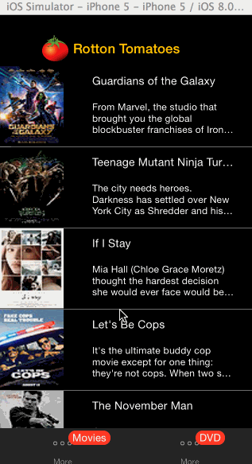

rotton_tomato_movie_app
=======================

(weekly project submission README))

This is an IOS demo application for calculating tips [see project requirement here](https://gist.github.com/timothy1ee/6858b706304a2397a7e2). See the [simple version tip calculator ](http://vimeo.com/102084767) for a step-by-step tutorial.

Time spent: 8 hours spent in total

Completed user stories:

 * [x] Required: User can view a list of movies from Rotten Tomatoes. Poster images must be loading asynchronously.
 * [x] Required: User can view movie details by tapping on a cell
 * [x] Required: User sees loading state while waiting for movies API. (using 3rd party libraries at cocoacontrols.com.)
 * [x] Required: User sees error message when there's a networking error.
 * [x] Required: User can pull to refresh the movie list.

 * [x] Optional: Customize the navigation bar.
 * [x] Optional: Add a tab bar for Box Office and DVD.

Walkthrough of all user stories:

GIF created with [LiceCap](http://www.cockos.com/licecap/).
